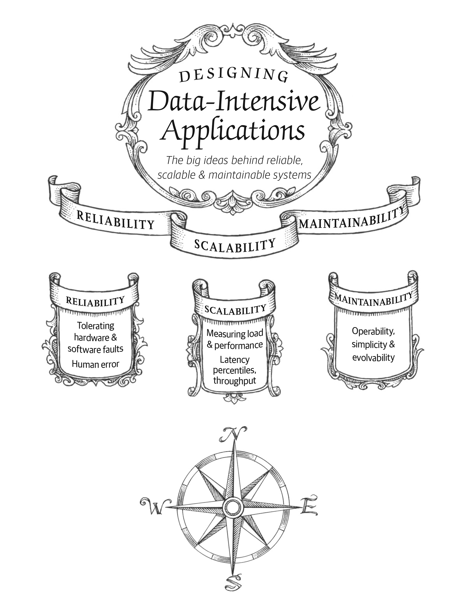

# Chapter 1: Reliable, Scalable, and Maintainable Applications

Main challenges of data-intensive applications are volume, complexity, and speed.

Standard building blocks for a data-intensive application:
- Databases: Store data so that they, or another application, can find it again later
- Caches: Remember the results of an expensive operation, to speed up reads
- Search indexes: Allow users to search data by keyword or filter it in various ways
- Stream processing: Send a message to another process, to be handled asynchronously
- Batch processing: Periodically crunch a large amount of accumulated data

## Thinking About Data Systems

This chapter will explore the fundamentals of what we are trying to achieve when building a data system: **R.M.S**.

- Reliability: Work correctly even in the face of adversity.
- Scalability: Have reasonable ways to deal with growth.
- Maintainability: Enable new developers to work on them productively.

## Reliability

A fault is a deviation of a system component from its spec.

Systems that anticipate faults are called fault-tolerant or resilient.

A failure is when the system as a whole stops providing the required service to the user.

It's best to design fault-tolerance mechanisms that prevent faults from causing failures.

### Hardware Faults

Redundancy can help mitigate hardware faults.

There is a move towards tolerating the loss of entire machines by using software fault-tolerance techniques. This has certain advantages operational advantages, e.g. rolling upgrades, etc.

### Software Errors

Systematic error within the system, usually correlated across nodes, and tend to cause many more system failures than hardware faults.

Bugs lie dormant for a long time until they are triggered by an unusual set of circumstances.

### Human Errors

Minimizes human errors by:
- Design systems in a way that minimizes opportunities for error.
- Decouple the places where people make the most mistakes from the places where they can cause failures.
- Test thoroughly at all levels, from unit tests to whole-system integration tests and manual tests.
- Allow quick and easy recovery from human errors, to minimize their impact.
- Set up detailed and clear monitoring, such as performance metrics and error rates.
- Implement good management and operations practices.

### How Important Is Reliability?

The cost of failure can be very high, especially in industries like finance, healthcare, etc. However, in other industries, the cost of failure is lower.

## Scalability

Describes a system's ability to cope with increased load.

### Describing Load

Load can be described with a few *load parameters*. The choice of parameters depends on the architecture of the system. They can be:

- Requests per second to a web server
- Ratio of reads to writes in a database
- Number of simultaneously active users in a chat room
- Hit rate on a cache

### Describing Performance

Performance can be described with different metrics depending on the system. They can be:

- **Throughput**, the number of records we can process per second, or the total time it takes to run a job on a dataset of a certain size. Common in batch processing systems.
- **Response time**, the time between a client sending a request and receiving a response. Common in online systems.

Since response time can vary a lot, it's common to think of it as a distribution of values.

Average response time is not good in telling the "typical" response time, it does not tell you how many users actually experienced that delay. Usually it is better to use percentiles.

The median is a.k.a. the 50th percentile, and sometimes abbreviated as *p50*. Same for *p95*, *p99*, and *p999*.

High percentile of response times, a.k.a. tail latencies, are important because they directly affect UX of the service.

Amazon describes time requirements for internal services in terms of p999 because the customers with the slowest requests are often those with the most data because they have made many purchases - and they are the most valuable customers.

Percentiles are often used in *service level objectives* (SLOS) and *service level agreements* (SLAs), contracts that define the expected performance and availability of a service.

Queuing delays can be a significant factor in response time. As a server can only process a limited number of requests in parallel (number of CPU cores, etc.) before subsequent requests are held up, *head-of-line blocking* can occur. Processing time may be small, but the client will see a slow overall response time. This is why it's important to monitor response times on the client side.

### Approaches for Coping with Load

- **Scaling up** (vertical scaling): Moving to a more powerful machine.
- **Scaling out** (horizontal scaling): Distributing the load across multiple smaller machines.

Distributing load across multiple machines is a.k.a. *shared-nothing* architecture. It is a common approach to combine two approaches: distribute the load across several fairly powerful machines over a large number of small virtual machines.

Some systems are *elastic*. They can automatically add computing resources when they detect a load increase, and remove resources when the load decreases.

Since scaling stateful services is harder than scaling stateless services, it is common to scale up your database until scaling cost or high-availability requirements force you to make it distributed.

## Maintainability

We should design software that minimizes pain during maintenance. Three design principles that help with maintainability:

- Operability: Make it easy for operations teams to keep the system running smoothly.
- Simplicity: Make it easy for new engineers to understand the system, by removing as much complexity as possible from the system.
- Evolvability: Make it easy for engineers to make changes to the system in the future.

### Operability: Making Life Easy for Operations

> Good operations can often work around the limitations of bad (or incomplete) software, but good software cannot run reliably with bad operations.
 
Responsibilities of operations teams:
- System health monitoring and incident response.
- Tracking down the cause of problems.
- Keeping software and platforms up to date.
- Keeping tabs on how systems affect each other.
- Capacity planning.
- Establishing good practices and tools for deployment, configuration management, and more.
- Perform complex maintenance tasks.
- Maintain system security as configurations change are made.
- Defining processes that make operations predictable and help keep the production environment stable.
- Preserving the organization's knowledge about the system.

Data systems can do various things to make routine tasks easy, including:
- Providing visibility into the runtime behavior and internals of the system, with good monitoring.
- Providing good support for automation and integration with standard tools.
- Avoiding dependency on individual machines, so that failures of an individual machine can be tolerated.
- Providing good documentation and an easy-to-understand operational model.
- Providing good default behavior, but also giving administrators the freedom to override defaults when needed.
- Self-healing where appropriate, and giving administrators manual control when necessary.
- Exhibiting predictable behavior, minimizing surprises.

### Simplicity: Managing Complexity

Possible symptoms of complexity:
- Explosion of the state space.
- Tight coupling of modules.
- Tangled dependencies.
- Inconsistent naming and terminology.
- Hacks aimed at solving performance problems.
- Special-casing to work around issues elsewhere

### Evolvability: Making Change Easy

How easy you can modify a data system, and adapt it to changing requirements, is closely linked to its simplicity and its abstractions.
