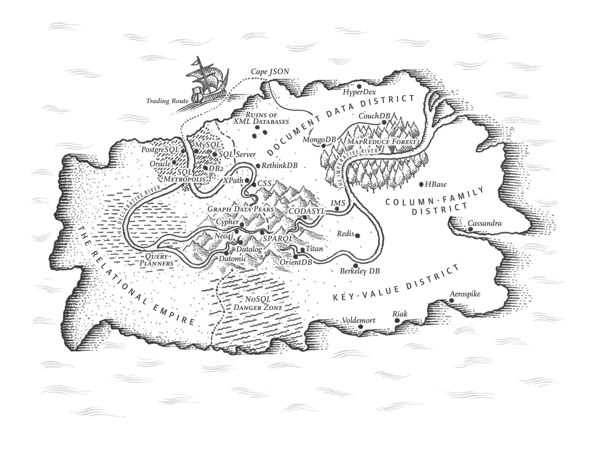

# Chapter 2: Data Models and Query Languages



Data models are the most important part of developing software. It affects how software is written and how developers think about the problem.

Most applications are built by layering one data model on top of another. For each one, the key question is: how is it represented in terms of the next lower-layer layer?

Each layer hides the complexity of the layers below it by providing a clean data model.

Since there are many different kinds of data models and some can lend themselves to certain applications better than others, it's important to choose the right data model for the job.

## Relational Model Versus Document Model

The most popular data model today is SQL, based on the relational model by Edgar Codd in 1970: data is organized into relations (tables) where each relation is an unordered collection of tuples (rows).

Each competitor to the relational model generated a lot of hype in its time, but it never lasted.

Relational database generalizes very well for a broad variety of use cases.

### The Birth of NoSQL

NoSQL is the latest attempt to overthrow the relational model's dominance. Several reasons for the rise of NoSQL databases:
- Need for greater scalability than relational databases can easily achieve, including very large datasets or very high write throughput.
- Widespread preference for free and open-source software over commercial database products.
- Specialized query operations that are not well supported by the relational model.
- Frustration with the restrictiveness of relational schemas, and a desire for a more dynamic and expressive data model.

Different applications have different requirements, and thus different technology choices. In the foreseeable future, *polyglot persistence*, using relational database alongside a broad variety of nonrelational datastores, will be the norm.

### The Object-Relational Mismatch

Relational database models need to be mapped to objects in application code through an awkward translation layer if the target programming language is object-oriented. This is called *impendance mismatch*.

Object-relational mapping (ORM) frameworks (ActiveRecord, Hibernate) reduce boilerplate code for this layer, but cannot hide the differences between the two models.

In the relational model, one-to-one relationships can be modeled as columns in the same table.

One-to-many relationships can be represented in various ways:
- Traditional SQL model: Put the "many" side's information in a separate table, with a foreign key reference to the "one" side.
- Modern SQL: Use a JSON or XML column to store the "many" side's information in the same table.
- Encode "many" side as a JSON or XML document and store it in a single text column, let the application interprets the data structure.

With the document model, self-contained documents (like a resume) can be stored in a single JSON or XML document.

Some document-oriented databases are MongoDB, RethinkDB, CouchDB, and Espresso.

The document representation has better *locality* than the multi-table schema. All the information is in one place and can be retrieved with a single query.

### Many-to-One and Many-to-Many Relationships

In the relational model, many-to-one relationships are easy to model because of joins.

Many-to-one relationships don't fit nicely into the document model because support for joins is often weak.

For databases that do not support joins, joins have to be emulated in the application code by making multiple queries to the database. This introduces data races and heavy load on the application layer.

Even if the initial version of an application fits well in a join-free document model, data has a tendency to become more interconnected as more features are added.

### Are Document Databases Repeating History?

IBM's Information Management System (IMS) was a hierarchical database system that was popular in the 1960s and 1970s. Like document databases, ISM:
- Works well with one-to-many relationships.
- Makes many-to-many relationships difficult.
- Does not support joins.

Developers had to denormalize the data or manually resolve references in the application code.

Various solutions were proposed to solve the limitations of the hierarchical model (IMS), including the *relational model* and the *network model*.

#### The network model

The network (CODASYL) model was a generalization of the hierarchical model. It allowed each record to have multiple parent and child records, forming a graph structure.

This allows for many-to-one and many-to-many relationships to be modeled.

The links between records were not foreign keys, but more like pointers in programming languages.

Acesssing a record requires following a path from the root record along these chains of links. This is called an *access path*.

A query in CODASYL is moving a cursor through the database by iterating over lists of records and following access paths.

While in the simplest case, an access path could be like the traversal of a linked list, in more complex cases, it could be like a tree or a graph traversal. Several different access paths could be defined for the same data. And programmers had to keep track of these different access paths in their head.

This was like navigating through an n-dimensional data space.

While manual access path selection makes efficient use of the then limited hardware, the core for querying and updating the database complicated and inflexible.

It was difficult to make changes to an application's data model.

#### The relational model

The relational model, by contrast, lays out all the data in the open: a relation (table) is a collection of tuples (rows).

The query optimizer automatically devices which parts of the query to execute in which order, and which indexes to use. These choices were effectively automatic "access paths," and the programmer did not have to think about them.

Querying data in new ways is simple as declaring a new index and let the query optimizer figure out whichever indexes are most appropriate. The relational model makes it easier to add new features to applications.

Query optimizers for relational databases are complicated beasts, but they only need to be built once and all the applcations that use the database can benefit from it.

#### Comparision to document databases

Document databases store nested records within their parent record rather than in a separate table.\

Represeting many-to-one and many-to-many relationships in document databases is similar to relational databases. The related item is referenced by a unique identifier (foreign key for the relational model, document reference for the document model). That identifier is resolved at read time by using a join or follow-up queries.


### Relational Versus Document Databases Today

The main arguments for document databases are:
- Schema flexibility
- Better performance due to locality
- For some applications, it is closer to the data structures used by the application

The main arguments for relational databases are:
- Better support for joins, and many-to-one and many-to-many relationships

#### Which data model leads to simpler application code?

If the data has a document-like structure (a tree of one-to-many relationships, where typically the entire is loaded at once), then the document model can be simpler. In this scenario, the relational model has to resort to *shredding* - splitting a document-like structure into multiple tables, which leads to cumbersome schemas and unnecessarily complicated application code.

The lack of joins and many-to-many relationships in document databases may never be a problem in some applications like analytics.

Using a document model in an application that uses many-to-many relationships can lead to more complex application code and worse performance:
- Denormalization: application code has to do more work to keep the denormalized data consistent.
- Emulated joins: Moves complexity of joins from the database to the application code and slower than a join performed by specialized code inside the database.

For highly interconnected data, the document model can be awkward, the relational model is acceptable, and graph models are the most natural.

### Schema flexibility in the document model

Most document databases and JSON support in relational databases do not enforce any schema on the data stored in them. Clients have no guarantees about the structure of the data they read.

*Schemaless* is a misleading term because the database still has an implicit schema: the structure of the data is determined by the application code. This is called *schema-on-read*, as opposed to *schema-on-write* (the traditional approach of relational database).

Schema-on-read vs. schema-on-write is similar to dynamic (runtime) type checking in programming languages vs. static (compile-time) type checking.

When an application wants to change the format of its data:
- In a document database, the application can write new data in the new format, and have application code handles both the old and new formats.
- In a relational database, the application can write a migration script that updates the data to the new format.

The schema-on-read approach can be more useful if the items in the collection don't all have the same structure for some reasons:
- There are many different types of objects
- The structure of the data is determined by external systems

Schemas may hurt more than help in these cases. Nevertheless, schemas are still useful for documenting and enforcing data structure.

### Data locality for queries

A document is stored as a single continuous string, encoded as JSON, XML or binary format. This *data locality* makes it more performant if your application often needs to access the entire document. Data split across multiple tables requires multiple index lookups, which may require more disk seeks and take more time.

This in turn can be wasteful on large documents if you only need to access a small part of it since the database has to load the entire document.

On updates, the entire document usually has to be rewritten. Only modifications that don't change the encoded size of a document can be done in place.

Recommendations:
- Keep documents small
- Avoid writes that increase the size of a document

Google's Spanner database offers locality properties in a relational data model, by allowing the schema to declare that a table's rows should be interleaved (nested) within a parent table

Oracle allows the same, using a feature called *multi-table index cluster tables*.

The *column-family* concept in the Bigtable data model (Cassandra, HBase) has a similar purpose.

### Convergence of document and relational databases

Most relational database systems have added support for XML and JSON. This includes functions to make local modifications to XML documents, index and query inside XML documents.

Document databases have also added support for relational-like joins.

Relational and document databases are becoming more similar over time and the data models complement each other, which is a good route to take in the future.

## Query Languages for Data

New ways of querying data were introduced after the relational model:
- SQL is a *declarative* query language: you specify the pattern of the data you want, not how to retrieve it.
- IMS and CODASYL used *imperative* code: you specify the steps that the database should take to find the data.

Advantages of a declarative query language:
- You can specify the pattern of the data you want and the database system's query optimizer can decide the most efficient way to execute the query.
- More concise and easier to work with.
- Hides implementation details of the database engine.
  - The database syhstem can introduce performance improvements without changing the query.
- Easier to parallelize because the order of operations is determined by the database system.
  - Especially in today's world where CPUs are getting faster by adding more cores rather than increasing clock speed.

### Declarative Queries on the Web

Advantages of declarative query languages extend beyong just databases: CSS in the web.

### MapReduce Querying

*MapReduce* is a programming model for processing large amounts of data in bulk across many machines, popularized by Google.

Some NoSQL datastores, including MongoDB and CouchDB, use it for performing read-only queries across many documents.

MapReduce sits between a declarative query language and a fully imperative query API: the logic of the query is expressed with snippets of code, which are executed repeatedly by the processing framework. It is based on two functions: the `map` function and the `reduce` function.

The same PostgreSQL query:

```sql
SELECT date_trunc('month', observation_timestamp) AS observation_month, 1
       sum(num_animals) AS total_animals
FROM observations
WHERE family = 'Sharks'
GROUP BY observation_month;
```

Can be expressed in MongoDB's MapReduce as:

```javascript
db.observations.mapReduce(
    function map() { // 2. Called once for every document that matches `query`, with `this` set to the document
        var year  = this.observationTimestamp.getFullYear();
        var month = this.observationTimestamp.getMonth() + 1;
        emit(year + "-" + month, this.numAnimals); // 3. `map` emits a key-value pair
    },
    function reduce(key, values) { // 4. Key-value pairs are grouped by key, and `reduce` is called once for each key
        return Array.sum(values); // 5. `reduce` sums the values for each key
    },
    {
        query: { family: "Sharks" }, // 1. Filter only shark species declaratively, MongoDB-specific extension to MapReduce
        out: "monthlySharkReport" // 6. Store the result in the `monthlySharkReport` collection
    }
);
```

`map` and `reduce` must be pure functions. This allows the database to run the functions anywhere, in any order, and rerun them on failure.

MapReduce is a low-level programming model for distributed execution on a cluster of machines. Higher-level query languages like SQL can be implemented as a pipeline of MapReduce operations. But there are distributed implementations of SQL that don't use MapReduce.

## Graph-Like Data Models

Many-to-many relationships are a distinguishing feature for different data models. 

For application with mostly one-to-many relationships (tree-structured) or no relationships between records, the document model is a good fit.

The relational model can handle simple cases of many-to-many relationships, but the more complex the connections of the data are, the more natural a graph model becomes.

A graph has two kinds of objects:
- *vertices* (*nodes*, *entities*).
- *edges* (*arcs*, *relationships*).

Applications of graph data models:
- Social graphs: Vertices are people, edges are relationships.
- The web graph: Vertices are web pages, edges are hyperlinks.
- Road or rail networks: Vertices are junctions, edges are roads or rail lines.

Well-known algorithms for graph data models:
- Shortest path: Find the shortest path between two vertices.
- PageRank: Algorithm used by Google Search on the web graph to rank web pages in search results.

Graphs are not limited to such *homogenous* data: it also works well as a consistent way to store different types of objects in a single datastore.

> Facebook maintains a single graph with many different types of vertices and edges: people, locations, events, checkins, and comments made by users; edges indicate which people are friends, which checkin happened in which location, who commented in which post, who attended which event, and so on.


There are several ways to structure:
- Property graph model: implemeneted by Neo4j, Titan, and InfiniteGraph.
- Triple-store model: implemeneted by Datomic, AllegroGraph, and others.

And query graph data:
- Cypher
- SPARQL
- Datalog

### Property Graphs

Each vertex consists of:
- A unique identifier.
- A set of outgoing edges.
- A set of incoming edges.
- A collection of properties (key-value pairs).

Each edge consists of:
- A unique identifier.
- The vertex at which the edge starts (the *tail* vertex).
- The vertex at which the edge ends (the *head* vertex).
- A label to describe the kind of relationship between the two vertices.
- A collection of properties (key-value pairs).

A graph store can be thought of consisting of two relational tables: one for vertices and one for edges.

```sql
CREATE TABLE vertices (
    vertex_id   integer PRIMARY KEY,
    properties  json
);

CREATE TABLE edges (
    edge_id     integer PRIMARY KEY,
    tail_vertex integer REFERENCES vertices (vertex_id),
    head_vertex integer REFERENCES vertices (vertex_id),
    label       text,
    properties  json
);

CREATE INDEX edges_tails ON edges (tail_vertex);
CREATE INDEX edges_heads ON edges (head_vertex);
```

Important aspects of the property graph model:
1. Any vertex can have an edge to any other vertex. No schema restrictions.
2. Given any vertex, you can efficiently find its incoming and outgoing edges, and traverse the graph both backward and forward. (Thus the indexes in the example above.)
3. Using labels for different kinds of relationships allows the storage of different kinds of information in a single graph.

For the above reasons, graphs are great for having flexibity in data modeling:
- Different kinds of regional structures in different countries.
- Quirks of history in different parts of the world.
- Varying granularity of data.

Graphs are good for evolvability: adding new features to an application means easily extending a graph.

### The Cypher Query Language

Declarative query language for property graphs, created for Neo4j.

```cypher
// A subset of the data in Figure 2-5, represented as a Cypher query.
CREATE
  (NAmerica:Location {name:'North America', type:'continent'}),
  (USA:Location      {name:'United States', type:'country'  }),
  (Idaho:Location    {name:'Idaho',         type:'state'    }),
  (Lucy:Person       {name:'Lucy' }),
  (Idaho) -[:WITHIN]->  (USA)  -[:WITHIN]-> (NAmerica),
  (Lucy)  -[:BORN_IN]-> (Idaho)
```

Once the vertices and edges are added to the database, we can start querying them.

```cypher
// Cypher query to find people who emigrated from the US to Europe.
MATCH
  (person) -[:BORN_IN]->  () -[:WITHIN*0..]-> (us:Location {name:'United States'}),
  (person) -[:LIVES_IN]-> () -[:WITHIN*0..]-> (eu:Location {name:'Europe'})
RETURN person.name
```

Cypher is declarative. You don't need to specify execution details when writing the query: the query optimizer automaticlaly chooses the most efficient strategy.

### Graph Queries in SQL

Graph data can be represented in a relational database, but can be queried using SQL. But this comes with some difficulty.

Variable-length traversal paths in a SQL query can be done using *recursive common table expressions* (the `WITH RECURSIVE` clause in SQL), which is very clumsy compared to Cypher.

```sql
-- The same query as Example 2-4, written in SQL using recursive common table expressions
WITH RECURSIVE

  -- in_usa is the set of vertex IDs of all locations within the United States
  in_usa(vertex_id) AS (
      SELECT vertex_id FROM vertices WHERE properties->>'name' = 'United States'
    UNION
      SELECT edges.tail_vertex FROM edges
        JOIN in_usa ON edges.head_vertex = in_usa.vertex_id
        WHERE edges.label = 'within'
  ),

  -- in_europe is the set of vertex IDs of all locations within Europe
  in_europe(vertex_id) AS (
      SELECT vertex_id FROM vertices WHERE properties->>'name' = 'Europe'
    UNION
      SELECT edges.tail_vertex FROM edges
        JOIN in_europe ON edges.head_vertex = in_europe.vertex_id
        WHERE edges.label = 'within'
  ),

  -- born_in_usa is the set of vertex IDs of all people born in the US
  born_in_usa(vertex_id) AS (
    SELECT edges.tail_vertex FROM edges
      JOIN in_usa ON edges.head_vertex = in_usa.vertex_id
      WHERE edges.label = 'born_in'
  ),

  -- lives_in_europe is the set of vertex IDs of all people living in Europe
  lives_in_europe(vertex_id) AS (
    SELECT edges.tail_vertex FROM edges
      JOIN in_europe ON edges.head_vertex = in_europe.vertex_id
      WHERE edges.label = 'lives_in'
  )

SELECT vertices.properties->>'name'
FROM vertices
-- join to find those people who were both born in the US *and* live in Europe
JOIN born_in_usa     ON vertices.vertex_id = born_in_usa.vertex_id
JOIN lives_in_europe ON vertices.vertex_id = lives_in_europe.vertex_id;
```

Pick a data model that is suitable for your application.

### Triple-Stores and SPARQL

Mostly equivalent to the property graph model, but with a different query language: SPARQL.

In a triple-store, all information is stored in the form of *triples*: subject-predicate-object.

For example: `Lucy - born_in - Idaho`.

The subject of a triple is a vertex. The object is either:
1. A value in a primitive datatype (string, number, date). In this case, the predicate-object is the key-value of a property on the subject vertex.
2. Another vertex in the graph. In this case, the triple is tail vertex - edge - head vertex.

### The Foundation: Datalog

Datalog provides the foundation for later query languages.

Instead of writing a triple as *(subject, predicate, object)*, we write it as *(predicate(subject, object))*.

## Summary

The relational model is good for applications with many-to-many relationships.

The document model is good for applications with one-to-many relationships.

The graph model is good for applications with complex, interconnected data.

Emulating one model in another is awkward. That's why we have different systems for different purposes.

There are many more data models:
- GenBank: specialized genome database for *sequence-similarity searchers*.
- Particle physics: *ROOT* data format for high-energy physics data. Reduce hardware costs while working with petabytes of data.
- *Full-text search*: Frequently used alongside databases for information retrieval.

> Literature on the relational model distinguishes several different normal forms, but the distinctions are of little practical interest. As a rule of thumb, if you’re duplicating values that could be stored in just one place, the schema is not normalized.

>  Foreign key constraints allow you to restrict modifications, but such constraints are not required by the relational model. Even with constraints, joins on foreign keys are performed at query time.
