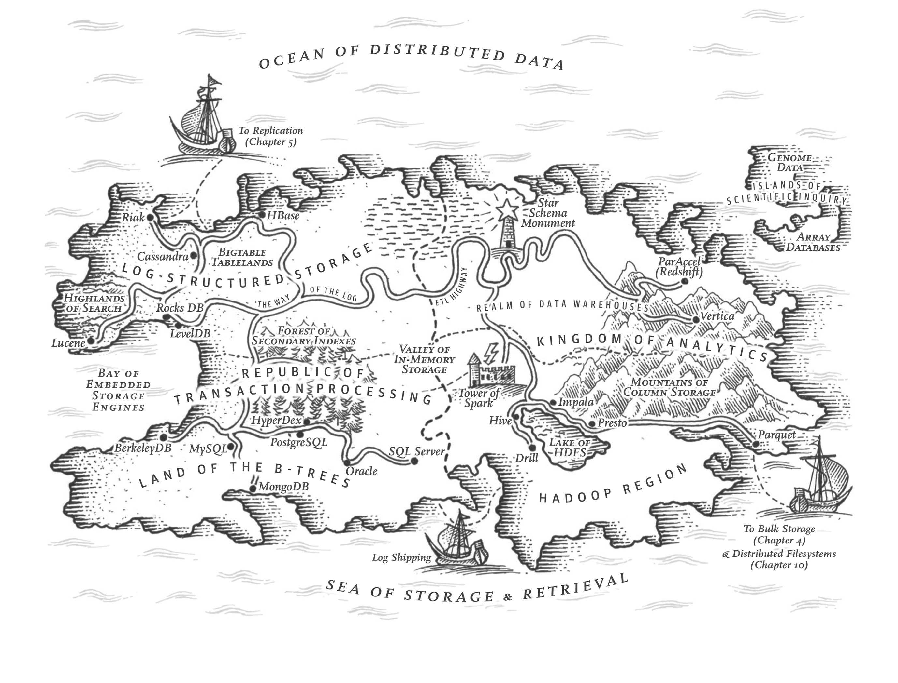

# Chapter 3: Storage and Retrieval

A database needs to do two things: store things when asked, and find them again later. This chapter discusses how databases store data given to them and how they retrieve it later.

To tune a storage engine to a particular workload, you need to have a rough idea of what the storage engine is doing under the hood.

## Data Structures That Power Your Database

There are two families of storage engines in traditional relational databases and most NoSQL databases: _log-structured_ storage engines and _page-oriented_ storage engines.

## Transaction Processing or Analytics?

There is a big difference between storage engines optimized for transactional and analytics workloads which will be discussed.

## Column-Oriented Storage

## Summary
