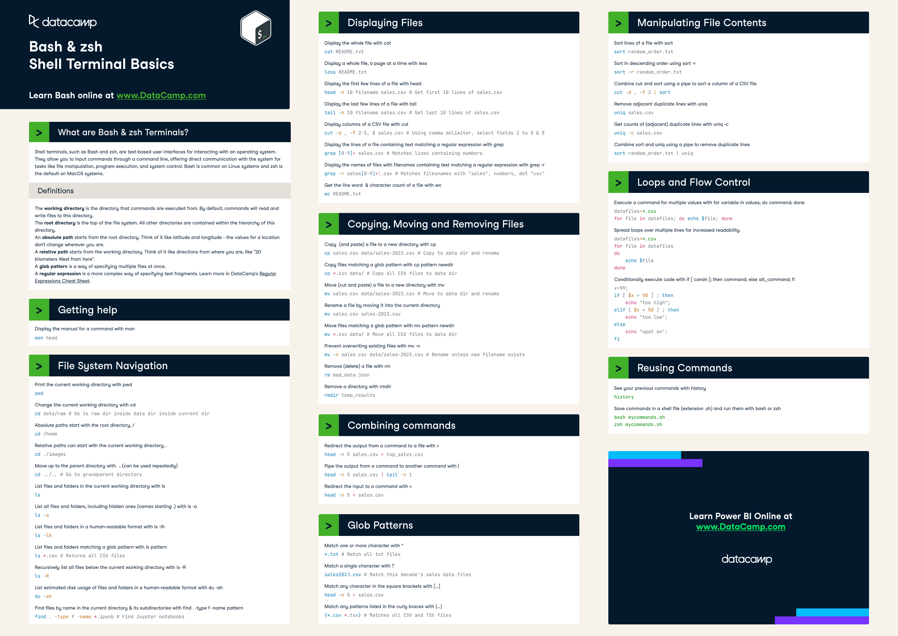
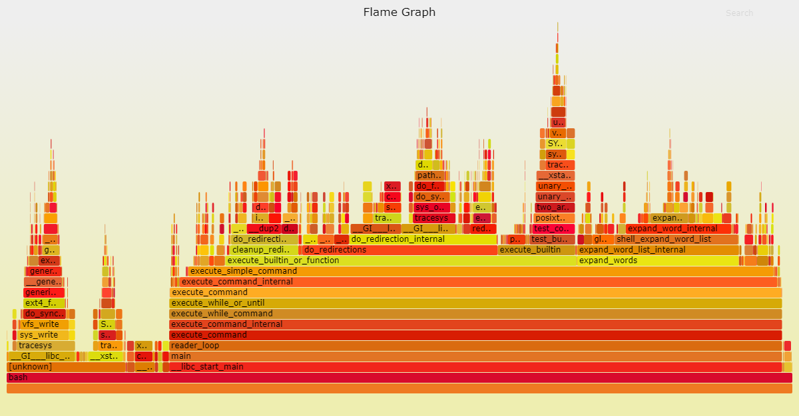
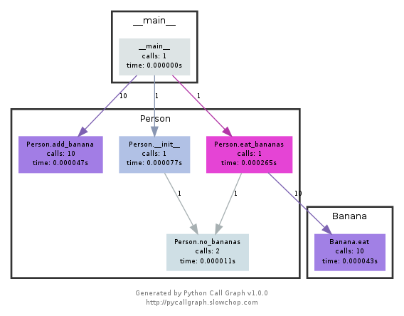

# The Missing Semester of Your CS Education

## Lecture 1: Course Overview + The Shell

The shell is a program that takes commands from the keyboard and gives them to the operating system to perform. In the past, it was the only way to interact with a computer.

They are built to be composable: small programs that do one thing well. As such, they can be combined and automated to perform complex tasks.

Shell is also a programming language. It has variables, loops, conditionals, functions, etc.

Platforms: Windows (Command Prompt, PowerShell), macOS (Terminal), Linux (Terminal).

Terminals are programs that run shells. They are often used interchangeably, but they are different.

Most popular shell on Linux is `bash` (Bourne Again SHell). `zsh` (Z SHell) is also popular.

### Using the shell



Machines usually come shipped with terminal-centric programs and they are stored in the file system. Shell uses the `PATH` environment variable to find these programs.

The shell uses the `PATH` variable to find programs. It is a colon-separated list of directories that the shell searches through when you run a command.

### Navigating in the shell

`ls -l` command shows the permissions of files and directories. The first column shows the permissions of the file. The permissions are divided into three groups: user, group, and others.

- The `user` group is the owner of the file.
- The `group` group is the group that the file belongs to.
- The `others` group is everyone else.

The third and fourth columns show the user and group that own the file.

### Connecting programs

Every program has three standard streams: `stdin`, `stdout`, and `stderr`.

- `stdin` is the standard input stream. Default is the keyboard.
- `stdout` is the standard output stream. Default is the terminal.
- `stderr` is the standard error stream. Default is the terminal.

Shell allows you to redirect these streams:

- `>` redirects `stdout` to a file
- `<` redirects `stdin` from a file
- `>>` appends `stdout` to a file
- `|` pipes `stdout` of one program to `stdin` of another

### A versatile and powerful tool

The root user is a special user that has the ability to do anything. It is the superuser. It is also known as `root`. Usually, you need to use `sudo` to run commands as the root user. `#` is the prompt for the root user (as opposed to `$` for regular users).

Writing to the `sysfs` filesystem mounted under `/sys` requires root privileges. `sysfs` exposes kernel parameters as files. It can be used to configure the kernel at runtime.

### Opening files

`xdg-open` opens a file with the default program. It is a cross-platform command.

## Lecture 2: Shell Tools and Scripting

Shell scripts are the next step in complexity after one-liners. They are a sequence of commands that are executed by the shell. Most shells have their own scripting language with variables, control flow, and its own syntax. We will be using `bash`.

### Variables

```bash
foo=bar
echo "$foo"
# prints bar
echo '$foo'
# prints $foo
```

### Control flow

`bash` has support for `if`, `case`, `while`, `for`, and `functions`.

```bash
mcd () {
    mkdir -p "$1"
    cd "$1"
}
```

Here `$1` is the first argument passed to the function. `bash` uses special variables to refer to arguments, error codes, and other relevant variables. Full list is [here](https://tldp.org/LDP/abs/html/special-chars.html).

- `$0` is the name of the script
- `$1` to `$9` are the first 9 arguments to the script
- `$#` - number of arguments
- `$@` - all arguments
- `$?` - exit status/return code of the last command (0 is success)
- `$$` - process ID of the current script
- `!!` - entire last command, including arguments. Common pattern is `sudo !!` to run the last command as root.
- `$_` - last argument of the previous command. Quickly get this with `Alt + .` or `Esc + .`

Commands return output to `stdout`, errors to `stderr`, and a return code.

Exit codes can be used to conditionally execute further commands using `&&` and `||`, both are short-circuiting.

Command substitution is a way to capture the output of a command into a variable.

```bash
files=$(ls)
for file in $files; do
    echo $file
done
```

Process substitution is a way to pass the output of a command to another command. This is done by executing the command, placing the output in a temporary file and substituting the file name in the command.

```bash
diff <(ls foo) <(ls bar)
```

### Shell globbing

Globbing is the process of expanding wildcards into a list of file names. It is done by the shell, not the program.

- `*` matches any string, including the empty string
- `?` matches any single character
- `{}` matches any of the comma-separated strings inside the braces

```bash
convert image.{png,jpg}
# Will expand to
convert image.png image.jpg

cp /path/to/project/{foo,bar,baz}.sh /newpath
# Will expand to
cp /path/to/project/foo.sh /path/to/project/bar.sh /path/to/project/baz.sh /newpath

# Globbing techniques can also be combined
mv *{.py,.sh} folder
# Will move all *.py and *.sh files


mkdir foo bar
# This creates files foo/a, foo/b, ... foo/h, bar/a, bar/b, ... bar/h
touch {foo,bar}/{a..h}
touch foo/x bar/y
# Show differences between files in foo and bar
diff <(ls foo) <(ls bar)
# Outputs
# < x
# ---
# > y
```

### General scripting tips

Scripts are not necessarily written in `bash`. They can be written in any language. `bash` is just a common choice because it is available on most systems. 

The shebang `#!` is used to specify the interpreter for the script. It is followed by the path to the interpreter.

```bash
#!/bin/bash
```

```python
#!/usr/bin/env python
```

It is good practice to write shebang lines using the `env` command. This allows the script to be run by any interpreter in the user's `PATH`. This makes the script more portable.

### Shell tools

#### Finding how to use commands

- `-h`/`--help` - most commands have a help flag that prints a brief description of the command and its flags
- `man` - manual pages
- `tldr` - simplified and community-driven

#### Finding files

- `find` - search for files in a directory hierarchy. Can also perform actions on the files found.

```bash
# Find all directories named src
find . -name src -type d
# Find all python files that have a folder named test in their path
find . -path '*/test/*.py' -type f
# Find all files modified in the last day
find . -mtime -1
# Find all zip files with size in range 500k to 10M
find . -size +500k -size -10M -name '*.tar.gz'

# Delete all files with .tmp extension
find . -name '*.tmp' -exec rm {} \;
# Find all PNG files and convert them to JPG
find . -name '*.png' -exec convert {} {}.jpg \;
```

- `fd` - a simpler alternative to `find`. It is faster and has a more user-friendly interface.
- `locate` - search for files in a database. It is faster than `find` but may not be up-to-date. It uses a database that is updated daily using `updatedb` via `cron`.

#### Finding code

- `grep` - search for patterns in files. It is a powerful tool that can search for regular expressions.
- `rg` - a faster alternative to `grep`. It is written in Rust and is faster than `grep` because it is parallelized.

#### Finding shell commands

Typing the up arrow key will cycle through the history of commands. `Ctrl + R` will search through the history.

- `history` - shows the history of commands
- `fzf` - a general-purpose fuzzy finder that can be used to search through the history of commands

## Lecture 3: Editors (Vim)

### Philosophy of Vim

Vim is a *modal* text editor: it has different modes for inserting text vs. manipulating text.

Vim is programmable and Vim's interface itself is a programming language. It is a language for editing text.

Keystrokes (with mnemonic names) are commands, and these commands are composable.

The end result is an editor that matches the speed of your thoughts.

### Modal editing

As a lot of programmer time is spent reading, navigating, and making small edits, Vim is optimized for these tasks with its multiple operating modes:

- **Normal**: for moving around a file and making edits
- **Insert**: for inserting text
- **Replace**: for replacing text
- **Visual**(plain, line, or block): for selecting blocks of text
- **Command-line**: for running a command

The initial/default mode the Normal mode. You'll spend most of your time in Normal mode and Insert mode.

- `<ESC>` to go from any mode back to Normal mode
- From Normal mode, enter:
  - `i` to enter Insert mode
  - `R` to enter Replace mode
  - `v` to enter Visual mode
  - `V` to enter Visual Line mode
  - `<C-v>` to enter Visual Block mode
  - `:` to enter Command-line mode

### Basics

#### Inserting text

- `i` to insert text before the cursor
- `I` to insert text at the beginning of the line
- `a` to insert text after the cursor
- `A` to insert text at the end of the line

#### Buffers, tabs, and windows

- A Vim session has one or more tabs
- Each tab has one or more windows (split panes)
- Each window shows one buffer at a time, an in-memory representation of a file
- By default, Vim opens with a single tab that contains a single window

#### Command-line

Enter command mode by typing `:` in Normal mode. It allows for opening, saving, and closing files. and quitting Vim among other things.

- `:q` quit (close window)
- `:w` save ("write")
- `:wq` save and quit
- `:e <filename>` open a file
- `:ls` list buffers
- `:help <topic>` open help
  - `:help :w` to open help for the `:w` command
  - `:help w` to open help for the `w` motion

### Vim's interface is a programming language

Keystrokes (with mnemonic names) are commands, and these commands are composable.

#### Movement

Vim movements in Normal mode's buffers are called "nouns" because they refer to chunks of text.

- `hjkl` left, down, up, right
- Words: `w` (next world), `b` (beginning of word), `e` (end of word)
- Lines: `0` (beginning of line), `^` (first non-blank character), `$` (end of line)
- Screen: `H` (top of screen), `M` (middle of screen), `L` (bottom of screen)
- Scroll: `Ctrl + u` (up), `Ctrl + d` (down)
- File: `gg` (beginning of file), `G` (end of file)
- Line numbers: `:<line number>` (go to line number), `{line number}G` (go to line number)
- Misc: `%` (matching parenthesis)
- Find: `f<char>`, `t<char>`, `F<char>`, `T<char>`
  - find/to forward/backward `<char>` on the current line
  - `,`/`;` to navigate matches
- Search: `/{regex}`, `n`/`N` to navigate matches

#### Selection

Can use movement keys to make selection.

#### Edits

Vim's editing commands are called "verbs" because they perform actions on nouns.

- `i` enter Insert mode
- `o`, `O` insert line below/above
- `d{motion}` delete {motion}
  - e.g. `dw` delete word, `d$` delete to end of line, `d0` delete to beginning of line
- `c{motion}` change {motion}
  - e.g. `cw` change word
- `x` delete character (equal to `dl`)
- `s` substitute character (equal to `cl`)
- Visual mode + manipulation commands
  - select text, `d` to delete, `c` to change, `y` to yank (copy)
- `u` to undo, `<C-r>` to redo
- `y` to yank (copy), `p` to paste

#### Counts

Combine nouns and verbs with a count, which repeats the command that many times.

- `3w` move forward 3 words
- `5j` move down 5 lines
- `7dw` delete 7 words

#### Modifiers

Modifiers change the meaning of a noun.

- `i` inner, `a` around
  - `ci(` change inside parentheses
  - `ci[` change inside brackets
  - `da'` delete around single quotes

### Customizing Vim

Vim is highly customizable. This is done by editing the `~/.vimrc` file containing Vimscript commands.

### Extending Vim

Use the built-in package manager to install plugins. Create the directory `~/.vim/pack/vendor/start/` and put plugins in there (e.g. via `git clone`).

- ctrlp.vim: fuzzy file finder
- ack.vim: code search
- nerdtree: file explorer
- vim-easymotion: magic motions

### Advanced Vim

#### Search and replace

`:s` (substitute) command

- `%s/foo/bar/g` replace all occurrences of `foo` with `bar` in the file
- `%s/\[.*\](\(.*\))/\1/g` replace named Markdown links with plain URLs

#### Multiple windows

- `:sp`/`:vsp` to split windows horizontally/vertically
- Can have multiple views of the same buffer

#### Macros

- `q{character}` to start recording a macro in register `{character}`
- `q` to stop recording
- `@{character}` to play back the macro
- Macro execution stops on error
- `{number}@{character}` to play back the macro multiple times
- Macros can be recursive
  - first clear the macro with `q{character}q`
  - record the macro, with `@{character}` in the middle (will be a no-op until recording is complete)

## Lecture 4: Data Wrangling

- `grep` - search for patterns in files
- `less` - a pager that allows you to scroll through files, similar to `man` pages
- `sed` - stream editor for filtering and transforming text
- `sort` - sorts lines of text
- `uniq` - filters out adjacent matching lines
- `awk` - pattern scanning and processing language

### Regular expressions

Regular expressions are a way to describe patterns in text. They are used by many tools, including `grep` and `sed`.

Most regular expressions are usually surrounded by `/` characters.

- `.` matches any character
- `*` matches zero or more of the preceding character
- `+` matches one or more of the preceding character
- `[abc]` matches any of the characters `a`, `b`, or `c`
- `(RX1|RX2)` matches `RX1` or `RX2`
- `^` matches the beginning of a line
- `$` matches the end of a line

## Lecture 5: Command-line Environment

### Job Control

#### Killing a process

When you are executing a command, your shell is using *signals* to communicate information to the process. When a process receives a signal, it stops its execution, deals with the signal and potentially changes of the flow of execution based on the information that the signal delivered. That's why signals are also called *software interrupts*.

- `Ctrl + C` sends the `SIGINT` signal to the process. This signal is used to interrupt a process.
- `Ctrl + \` sends the `SIGQUIT` signal to the process. This signal is used to quit a process and dump core.
- `SIGTERM` is a more generic signal that tells a process to exit gracefully. It is the default signal sent by the `kill` command with the syntax `kill -TERM <PID>`.

#### Pausing and backgrounding processes

- `SIGSTOP` is a signal that tells a process to stop. It is the signal sent by the `kill` command with the syntax `kill -STOP <PID>`.
- `Ctrl + Z` sends the `SIGTSTP` (Terminal Stop, terminal version of `SIGSTOP`) signal to the process. This signal is used to pause a process.
- `bg` is a command that sends a process to the background. It is used to resume a paused process.
- `fg` is a command that brings a background process to the foreground.
- `jobs` is a command that lists the jobs running in the background.
- `pgrep` is a command that lists the process IDs of processes that match a pattern.
- `ps` is a command that lists the processes running on the system.
- `$!` refers to the last backgrounded job
- The `&` suffix sends a command to the background
- `Ctrl + Z` followed by `bg` is a common pattern to send a process to the background
  - Any backgrounded processes are still children processes of the shell and will die if the terminal is closed (this will send the `SIGHUP` signal)
  - Running the program with `nohup` (a wrapper to ignore `SIGHUP`), or use `disown` to prevent this, or use a terminal multiplexer
- `SIGKILL` is a signal that tells a process to stop immediately. It is sent by the `kill` command with the syntax `kill -KILL <PID>`. It always terminates the process but can have bad side effects such as leaving orphaned children processes

### Terminal Multiplexers

Terminal multiplexers like `tmux` allow you to multiplex terminal windows using panes and tabs for interaction with multiple shell sessions.

`tmux` has the following hierarchy of objects:
- **Sessions** - an independent workspace with one or more *windows*
  - `tmux` starts a new session
  - `tmux new -s <session-name>` starts a new session with a name
  - `tmux ls` lists all sessions
  - Within a session, `<C-b> d` detaches from the session
  - `tmux a` attaches the last session, specficy the target with the `-t` flag
- **Windows** - visually separate parts of the same sessions. Similar to tabs in editors or browsers
  - `<C-b> c` creates a new window
    - Terminate the shells using `<C-d>`
  - `<C-b> n` and `<C-b> p` to navigate between windows
  - `<C-b> 0` to `<C-b> 9` to navigate to a specific window
  - `<C-b> ,` to rename a window
  - `<C-b> w` to list windows
- **Panes** - multiple shells in the same visual display
  - `<C-b> "` splits the window horizontally
  - `<C-b> %` splits the window vertically
  - `<C-b> <arrow>` to navigate between panes
  - `<C-b> z` to zoom in/out of a pane
  - `<C-b> [` to start scrollback. Press `<space>` to start a eelection and `<enter>` to copy
  - `<C-b> <space>` to cycle through pane arrangements

### Aliases

### Dotfiles

Dotfiles are plain-text configuration files.

On shell startup, it will read many files to load its configuration.

- `bash` - `~/.bashrc`, `~/.bash_profile`
- `git` - `~/.gitconfig`
- `vim` - `~/.vimrc`, `~/.vim` directory 
- `ssh` - `~/.ssh/config`
- `tmux` - `~/.tmux.conf`

Organize your dotfiles by placing them in their own version-controlled directory, and **symlinked** into place using a script. Benefits are:
- Easy installation: if you log in to a new machine, applying your customizations will only take a minute.
- Portability: your tools will work the same way everywhere.
- Synchronization: you can update your dotfiles anywhere and keep them all in sync.
- Change tracking: you’re probably going to be maintaining your dotfiles for your entire programming career, and version history is nice to have for long-lived projects.

#### Portability

Configurations might not work when working with several machines. You can use `if` statements to apply machine specific customizations

```bash
if [[ "$(uname)" == "Linux" ]]; then {do_something}; fi

# Check before using shell-specific features
if [[ "$SHELL" == "zsh" ]]; then {do_something}; fi

# You can also make it machine-specific
if [[ "$(hostname)" == "myServer" ]]; then {do_something}; fi
```

### Remote Machines

Use `ssh` to use remote servers in order to deploy backend software or run a server with higher computational capabilities.

#### Executing commands

You can even run commands directly over `ssh`:

```bash
ssh foobar@server ls # will execute `ls` in the home directory of `foobar`
```

It also works with pipes.

#### SSH keys

Key-based authentication uses public-key cryptography to prove to the server that the client owns the secret private key without revealing the key.

#### Copying files over SSH

- `ssh+tee` - `ssh` into the remote machine and use `tee` to write the file
- `scp` - secure copy, a command-line tool to copy files over SSH
- `rsync` - a tool to synchronize files and directories between two locations

#### Port forwarding

Port forwarding allows you to securely access a service running on a remote machine by forwarding the port to your local machine. It comes in two flavors: local and remote.

- Local port forwarding: forwards a port from the client machine to the server machine
- Remote port forwarding: forwards a port from the server machine to the client machine

#### SSH configuration

You can configure SSH to use specific settings for specific hosts. This is done by creating a `~/.ssh/config` file.

### Shells & Frameworks

- `zsh` - superset of `bash`, with more features and better defaults
- `fish` - friendly interactive shell 

Frameworks can improve shell programs by providing additional features and shortcuts.

- `oh-my-zsh` - a framework for managing your `zsh` configuration
- `prezto` - a configuration framework for `zsh`

### Terminal Emulators

- `Alacritty` - a fast, GPU-accelerated terminal emulator
- `kitty` - a modern, hackable terminal emulator

## Lecture 6: Version Control (Git)

## Lecture 7: Debugging and Profiling

Dealing with buggy and resource hungry code requires debugging and profiling tools.

### Debugging

#### Printf debugging and Logging

The naive approach is to add print statements around where the problem might be and keep iterating until the problem is found.

A better approach would be to use logging instead:

- Log to files, sockets or even remote servers instead of standard output
- Logging supports severity levels (INFO, DEBUG, WARN, ERROR, etc.) which allows for output filtering
- For new issues, there's a high chance that the logs will contain enough information to diagnose the problem

Make logs more readable with color codes. Terminals support ANSI escape codes for colors.

#### Third party logs

Client side error messages might not be enough when detecting issues in larger software systems. 

Most systems write their logs somewhere in the system. In UNIX systems, it is common for programs to write their logs under `/var/log`.

- The NGINX websesrver places its logs under `/var/log/nginx`
- More recently, systems have started using a **system log**, which is where all of your log meesages. Most Linux systems use `systemd`, a system daemon that controls services in your system. `systemd` places the logs under `/var/log/journal` which can be accessed using the `journalctl` command.
- The `logger` shell program can be used for logging messages to the system log.

#### Debuggers

Debuggers are programs that let you interect with the execution of a program:

- Halt the execution of a program when it reaches a certain line
- Step through the program one instruction at a time
- Inspect the values of variables after the program crashed
- Conditionally halt the execution when a given condition is met

#### Specialized tools

- `dtrace` and `strace` - trace syscalls and signals
- `tcpdump` and `wireshark` - network traffic analysis
- Chrome/Firefox developer tools - web debugging

#### Static Analysis

Static analysis programs take source code as input and analyze it using coding rules to reason about its correctness. E.g., `mypy`, `pyflakes` for Python, `shellcheck` for shell scripts.

**Code linting** refers to most editors' support of displaying the output of static analysis tools in the editor itself. Other types of issues displayed are stylistic violations and insecure constructs

Code formatters are complementary to linters. They automatically format code to a consistent style. E.g., `black` for Python, `prettier` for JavaScript.

### Profiling

Profilers and monitoring tools help you understand which parts of your program are taking most of the time and/or resources so you can focus on optimizing them.

#### Timing

Wall clock time can be misleading since the computer might be running other proicesses at the same time or waiting for events to happen. It's important for tools to make a distinction between Real, User, and System time:

- *Real* - Wall clock elapsed time from start to finish of the program, including time taken by other processes and time taken while blocked (e.g., waiting for I/O or network)
- *User* - amount of time spent in the CPU running user code
- *System* - amount of time spent in the CPU running kernel code

In general, User + Sys tells you how much time your process actually spent in the CPU.

#### Profilers

##### CPU

Most common type. Two main types of CPU profiles: *tracing* and *sampling*.

- Tracing profilers keep track of every function call
- Sampling profilers probe the program periodically and record the stack trace

They use these records to present aggregate statistics about the program's execution.

Line profilers are a type of CPU profiler that measure the time spent in each line of code, which in some cases, are more intuitive than function-level profilers.

##### Memory

In C or C++, memory leaks can cause the program to never release memory it doesn't use anymore. Tools like `valgrind` can help identify these.

In garbage-collected languages like Python or Java, it is still useful to have a memory profiler because as long as you have pointers to objects in memory, they won't be garbage collected.

#### Event profiling

Sometimes it's helpful to view the program's execution as a black box when profiling. The `perf` command abstracts away CPU differences and reports system events related to your program. It can easily report poor cache locality, high amount of page faults or livelocks.

#### Visualization

There are many tools for displaying profiler's output in a more human-readable way.



Flame graphs - display a hierarchy of function calls across the Y axis and time taken proportional to the X axis. They also let you zoom into specific parts of the program and get their stack traces.



Call graphs - display the relationships between subroutines within a program by displaying functions as nodes and function calls as edges.

#### Resource monitoring

The first step towards analyzing the performance of a program is to understand what its actual resource consumption is.

- General monitoring - `htop`, `top` - presents statistics about currently running processes on the system
- I/O operations - `iotop` - displays I/O usage information
- Disk usage - `df` - displays metrics per partitions, `du` - displays disk usage per file for the current directory
- Memory usage - `free` - display total amount of free and used memory in the system
- Open files - `lsof` - lists files' informations for ones opened by processes
- Network connection and config - `ss` - monitor incoming and outgoing network packet and interface statistics, `ip` - show and manipulate routing, devices, policy routing and tunnels
- Network usage - `nethogs` and `iftop` - interactive CLI tools for monitoring network traffic

Artificially impose loads on the maching using the `stress` command.

#### Specialized tools

Sometimes, black box profiling is all you need.

`hyperfine` quickly benchmarks command line programs.

## Lecture 8: Metaprogramming

Metaprogramming is a collective term for a set of things about the *process* of writing code rather than the code itself. It can refer to systems for building and testing code, and for managing dependencies. It can also mean "programs that operate on programs".

### Build systems

For most projects, there is a "build process", which might have many steps and many branches, to perform to go from inputs to outputs.

For most build systems, there are a number of *dependencies*, a number of *targets*, and *rules* for going from one to the other.

- A target is specified
- The build system finds all the transitive dependencies of the target
- The build system applies the rules to produce intermediate targets all the way until the final target has been produced
- Ideally, the build system will only rebuild the targets that have changed since the last build

`make` is one common build system available on most UNIX systems. It uses a `Makefile` to specify the targets, dependencies, and rules.

```make
paper.pdf: paper.tex plot-data.png
	pdflatex paper.tex

plot-%.png: %.dat plot.py
	./plot.py -i $*.dat -o $@
```

#### Depedency management

Dependencies might be:

- installed programs (like `python`)
- system packages (like `openssl`)
- programming language libraries (like `matplotlib`)

These days, most dependencies will be available through a centralized *repository* of dependencies that provides a convenient installation mechanism.

- `apt` - package manager for Debian-based systems
- RubyGems - package manager for Ruby libraries
- PyPi - package manager for Python libraries
- Arch User Repository - community-driven package manager for Arch Linux

One common aspect of these package managers is *versioning*.

A major benefit of versioning is to help ensure software keeps working.

*Semantic versioning* is a versioning scheme helps to communicate the nature of changes in a new version. Every version number has three parts: `MAJOR.MINOR.PATCH`.

- If a new release does not change the public-facing API, increase the patch version
- If you *add* to your API in a backwards-compatible way, increase the minor version
- If you *change* your API in a backwards-incompatible way, increase the major version

This unlocks some major advantages:

- If a projects depends on a library, it should be safe to use the latest release with the same major version number as the one you started with
- Prevents you from accidentally upgrading to a version that breaks your code

In dependency management systems, *lock file* is a file that lists the exact version of each dependency in a project. Usually, an explicit update command is required to upgrade to newer versions of your dependencies, essentially updating the project's lock file.

Having a lock file helps: 

- Avoid unnecessary recompiles
- Having reproducible builds
- Not automatically updating to the latest version (which may be broken)

An extreme version of this is *vendoring*, where you copy the source code of your dependencies into your project. This is a good way to ensure that your project will always build and introduce your own changes, but you have to explicitly pull in any updates from the upstream maintainers over time.

### Continuous integration systems

#### A brief aside on testing

Some testing approaches and terminology:

- Test suite: a collective term for all the tests
- Unit test: a “micro-test” that tests a specific feature in isolation
- Integration test: a “macro-test” that runs a larger part of the system to check that different feature or components work together.
- Regression test: a test that implements a particular pattern that previously caused a bug to ensure that the bug does not resurface.
- Mocking: to replace a function, module, or type with a fake implementation to avoid testing unrelated functionality. For example, you might “mock the network” or “mock the disk”.

## Lecture 9: Cryptography
