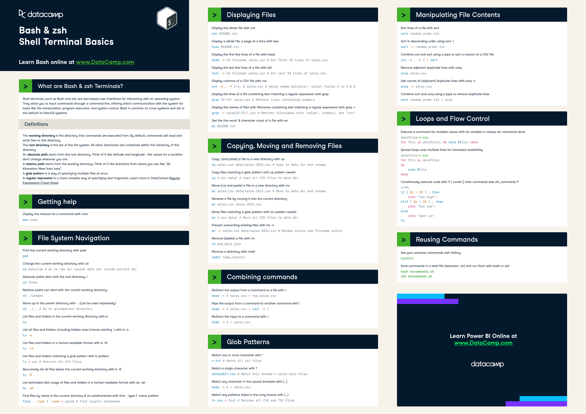

# The Missing Semester of Your CS Education

## Lecture 1: Course Overview + The Shell

The shell is a program that takes commands from the keyboard and gives them to the operating system to perform. In the past, it was the only way to interact with a computer.

They are built to be composable: small programs that do one thing well. As such, they can be combined and automated to perform complex tasks.

Shell is also a programming language. It has variables, loops, conditionals, functions, etc.

Platforms: Windows (Command Prompt, PowerShell), macOS (Terminal), Linux (Terminal).

Terminals are programs that run shells. They are often used interchangeably, but they are different.

Most popular shell on Linux is `bash` (Bourne Again SHell). `zsh` (Z SHell) is also popular.

### Using the shell

Machines usually come shipped with terminal-centric programs and they are stored in the file system. Shell uses the `PATH` environment variable to find these programs.

The shell uses the `PATH` variable to find programs. It is a colon-separated list of directories that the shell searches through when you run a command.

### Navigating in the shell

`ls -l` command shows the permissions of files and directories. The first column shows the permissions of the file. The permissions are divided into three groups: user, group, and others.

- The `user` group is the owner of the file.
- The `group` group is the group that the file belongs to.
- The `others` group is everyone else.

The third and fourth columns show the user and group that own the file.

### Connecting programs

Every program has three standard streams: `stdin`, `stdout`, and `stderr`.

- `stdin` is the standard input stream. Default is the keyboard.
- `stdout` is the standard output stream. Default is the terminal.
- `stderr` is the standard error stream. Default is the terminal.

Shell allows you to redirect these streams:

- `>` redirects `stdout` to a file
- `<` redirects `stdin` from a file
- `>>` appends `stdout` to a file
- `|` pipes `stdout` of one program to `stdin` of another

### A versatile and powerful tool

The root user is a special user that has the ability to do anything. It is the superuser. It is also known as `root`. Usually, you need to use `sudo` to run commands as the root user. `#` is the prompt for the root user (as opposed to `$` for regular users).

Writing to the `sysfs` filesystem mounted under `/sys` requires root privileges. `sysfs` exposes kernel parameters as files. It can be used to configure the kernel at runtime.

### Opening files

`xdg-open` opens a file with the default program. It is a cross-platform command.

## Lecture 2: Shell Tools and Scripting

