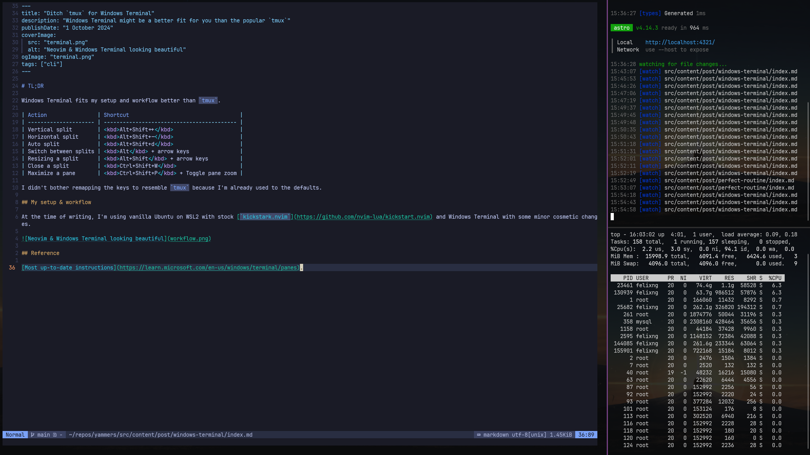

# TL;DR

Windows Terminal fits my setup and workflow better than `tmux`.

<!-- TODO: Fix dark mode -->

| Action                | Shortcut                                   |
| --------------------- | ------------------------------------------ |
| Vertical split        | <kbd>Alt+Shift++</kbd>                     |
| Horizontal split      | <kbd>Alt+Shift+-</kbd>                     |
| Auto split            | <kbd>Alt+Shift+d</kbd>                     |
| Switch between splits | <kbd>Alt</kbd> + arrow keys                |
| Resizing a split      | <kbd>Alt+Shift</kbd> + arrow keys          |
| Close a split         | <kbd>Ctrl+Shift+W</kbd>                    |
| Maximize a pane       | <kbd>Ctrl+Shift+P</kbd> + Toggle pane zoom |

I didn't bother remapping the keys to resemble `tmux` because I'm already used to the defaults.

## My setup & workflow

At the time of writing, I'm using vanilla Ubuntu on WSL2 with stock [`kickstark.nvim`](https://github.com/nvim-lua/kickstart.nvim) and Windows Terminal with some minor cosmetic changes.

## Reference

[Most up-to-date instructions](https://learn.microsoft.com/en-us/windows/terminal/panes).
